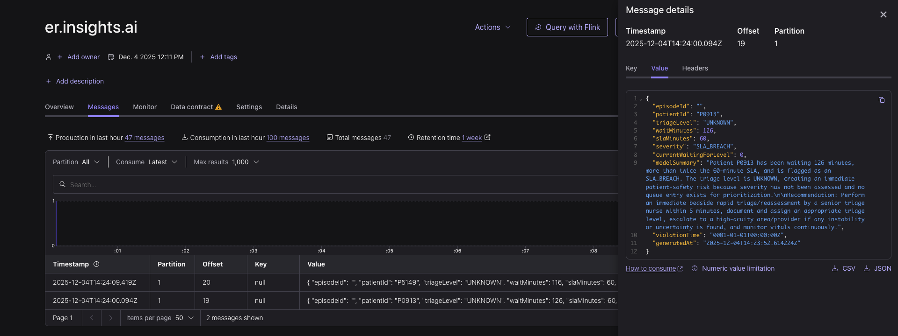
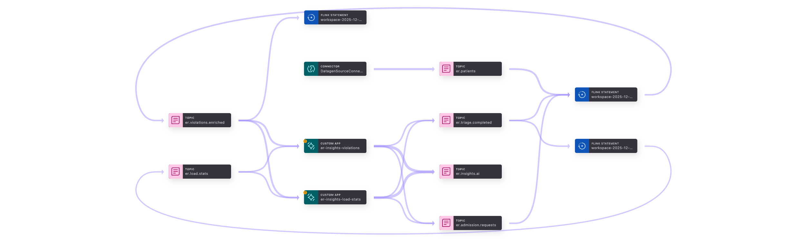

# Emergency Room Real-Time AI Insights
### Confluent AI Day EMEA Hackathon Project 2025

This project demonstrates how **Confluent Cloud**, **Flink SQL**, **Schema Registry**, **Kafka Connect**, **Go**, and **OpenAI** can be combined to create a real-time monitoring and AI-driven insight system for Emergency Rooms (ER).

The goal is to detect waiting time SLA breaches and generate **AI-powered operational recommendations** that help ER coordinators take immediate action.

All output streams are visualized directly in **Confluent Cloud Control Center**.

---

## 📌 Overview

The system simulates ER events (patient admissions and triage completions), processes them in real-time using Flink SQL, and identifies:

- SLA violations by triage level
- Queue load per triage level
- Combined enriched events requiring operational attention

A Go microservice consumes enriched streams and uses **OpenAI GPT** to generate short, actionable summaries.  
These insights are written back into a Kafka topic (`er.insights.ai`).

---

## 🧩 Components

### **1. ER Event Simulator (Go)**
Produces two topics:

- `er.admission.requests`
- `er.triage.completed`

These serve as the real-time hospital event feed.

### **2. Flink SQL Pipelines**

Flink performs:

- Joins between admission and triage
- SLA breach detection
- Windowed load statistics per triage level
- Writes results to:

    - `er.violations.enriched`
    - `er.load.stats`

### **3. AI Insight Service (Go)**

Consumes:

- `er.violations.enriched`
- `er.load.stats`

Generates:

- A concise summary powered by OpenAI (`gpt-5-mini` or similar)
- Operational recommendation for ER coordinators

Outputs results to:

- `er.insights.ai`

Example:

Lineage Diagram:

